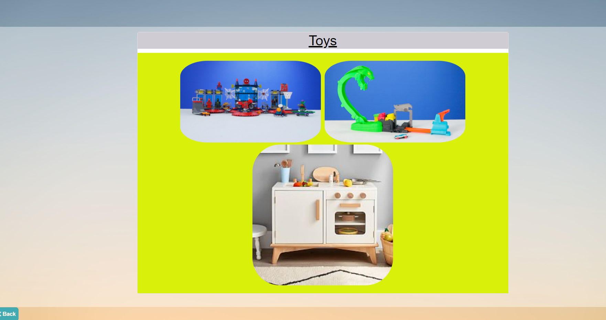

# Brilliant-Bananas-Project Inventory Warehouse App
An Inventory App for 4 Warehouses. 
---

## Table of contents

- [Introduction](#introduction)
- [Competencies](#competencies)
- [Demo](#demo)
- [Technologies](#technologies)
- [Setup](#setup)
- [Features](#features)
- [Contact](#contact)

---

## Introduction

Each warehouse displays a list of all items in each aisle.The user can view details of each item like name, price, description and category by clicking on any specific item from the list. A new item can be added in each aisle by submitting the form. An item can also be removed from the warehouse.

---

## Competencies

#JF 1.5

- Knows how teams work effectively to produce software and how to contribute appropriately

#JF 2.3

- Applies logical thinking. For example, uses clear and valid reasoning when making decisions related to undertaking work
  instructions

#JF 3.4

- Able to create simple software designs to effectively communicate understanding of the program

#JF 4.5

- Is able to build, manage and deploy code into the relevant environment

#JF 6.1

- Knows how best to communicate using different communication methods and how to adapt appropriately to different audiences
---

## Demo-View the Application 

[Demo](https://murmuring-chamber-30533.herokuapp.com/)

---

## Screenshots

---

## Link of Website

- https://murmuring-chamber-30533.herokuapp.com/

- https://brilliant-bananas-project.herokuapp.com/

---

## Technologies

- Javascript - version 1.0.0
- Node.js - version 14.15.4
- Express.js - version 4.16.4
- Sequelize - version 6.6.5
- Sqlite3 -  version 5.0.2
- Express - version 4.17.1
- Jest - version 27.0.6
- Handlebars - version 4.7.7

---

## Setup

After cloning, need to add files that are in gitignore:

- `npm install`
- `node bin/populateDB.js (npm run seed)`
- `node server.js         (npm start)`
- `npm run dev`
- NPM Scripts extension to VS code 

---

## Features

Users should be able to:

- views and selects the warehouse inventory.
- view all the items or an individual item in the inventory. 
- add and edit an item by completing the form.
- remove an item .

Stretch Goals:

- Sign up and login using OAuth.
- Add shopping functionality .
- Ability to show items out of stock in the inventory.
- Delete warehouse and aisle.
- To make the app mobile friendly.
- To perform server side validations.

---

## Contact

- [Afreen](https://github.com/afreensafdar)
- [Chad](https://github.com/)
- [Sharon](https://github.com/)
- [Lindsey](https://github.com/)

---

## Team Constitution:
- Be respectful.
- Look out and help each other.
- Communicate and don't get stuck on any blockers for long time.
- Create new branch for every issue.Never merge your work on main branch.
- Inform each other for pull request.
- Take breaks in between.

---

## Git Commands

 **To create branch and pull request**
- git checkout -b newbranchname (create a new branch for each issue) 
- git branch (To confirm which branch you are on)
- git add . (To add all the changed files) 
- git status (To check the status of the files) 
- git commit -m "message"
- git push -upstream newbranchname (To push code)
- Create Pull request 
- git branch -D newbranchname (To delete branch)
- git branch -d newbranchname

  **Other git commands**
- git fetch origin master
- git reset --hard origin/main (To overide files)
- git rm -r --cached . 
     - git add .
- git rm --cached db.sqlite

---

 ## UML Diagrams
   - **[Activity Diagram](./UML/activitydiagram/)**
   - **[Class Diagram](./UML/Warehouse%20UML/classdiagram.png/)**
   - **[Wire Frame](./UML/wireframe/)**
   - **[Schema Design](./UML/Warehouse%20UML/schemadesign.png/)**
   - **[Sequence Diagram](./UML/Warehouse%20UML/sequence.png/)**
   - **[Use Case](./UML/Warehouse%20UML/usecase.png/)**
                 

---
##Requirements
It's recommended to run it on Node version 8+.

$ nvm install v8.7.0
$ node -v
v8.7.0
You should be able to run any file from most browser's console or from the command line:

$ node JavaScript/<file>.js

---
##Testing
To test JavaScript files navigate to the corresponding folder and install the dependencies:

$ cd JavaScript && npm i
For testing we're using Jest, simply run:

$ npm test

