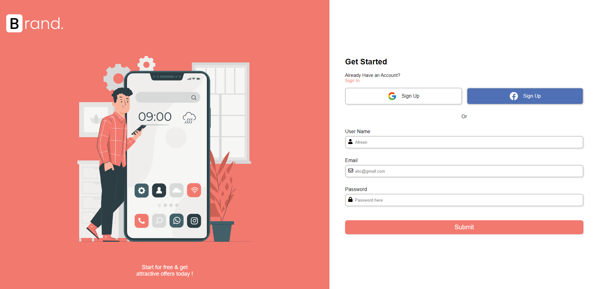
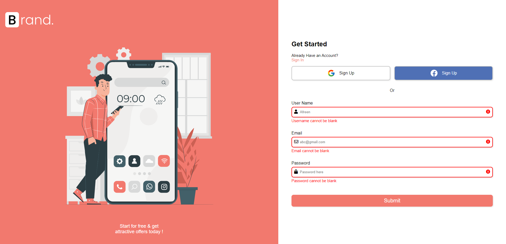
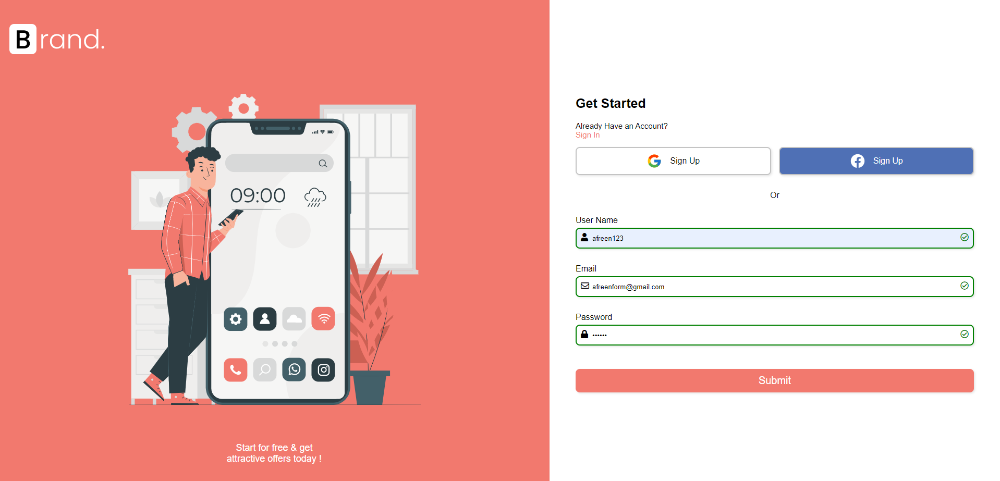
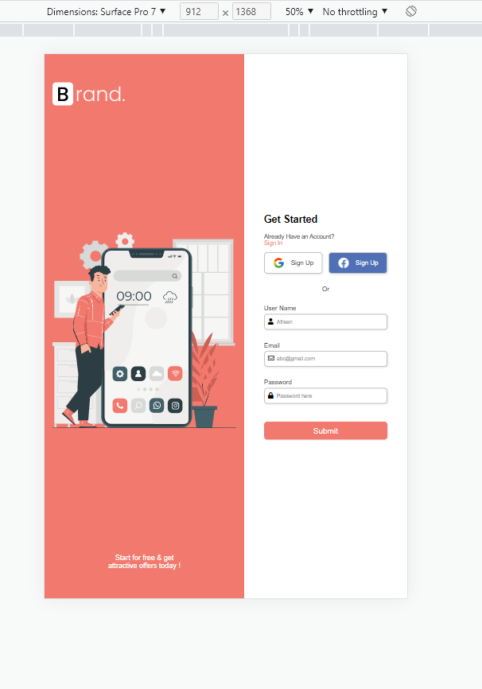

# Login Form Validation -JavaScript
## Build a JS Project
---

## Table of contents

- [Introduction](#introduction)
- [Competencies](#competencies)
- [Demo](#demo)
- [Technologies](#technologies)
- [Setup](#setup)
- [Features](#features)
- [Contact](#contact)

---

## Introduction

This is a simple Login form that uses HTML, CSS, Javascript, media queries for responsive and performs client side input validation.

---

## Competencies

#JF 1.7

- Demonstrates creativity and tenacity in their approach to solutions and the methods used to come to a solution for example, sees the task through to the end by devising new solutions and despite obstacles and problems along the way.

#JF 2.4

- Demonstrates commitment to continued professional development.

#JF 6.4

- Works independently and takes responsibility. For example, has a disciplined and responsible approach to risk, and stays motivated and committed when facing challenges.

---

## Demo- The published To-do App

---

## Screenshots

---

## Technologies

- HTML
- CSS 
- Javascript 

---

## Setup

After you clone 

- `Right click index.html -> Open in browser`

---

## Features

User 
- provides login information , success if entered correctly.
- if submits with no information, gives alert to enter credentials.

Stretch Goals:

- Sign up and login functionality with social media.
- To have server-side validations and database.

---

## Contact

- [Afreen](https://github.com/afreensafdar)

---

